# Report · Headline News

Applicant Showcase App for Symmetry, delivered from the fork
[Jav1ex/starter-project-symmetry](https://github.com/Jav1ex/starter-project-symmetry).

- **Demo video:** [Headline News on a phone (Google Drive)](https://drive.google.com/file/d/1o1zseRYCuIoqlNz6Ffylt0bYo1mek1N6/view?usp=sharing)
- **Screenshots:** [docs/report/screenshots](./report/screenshots), embedded in section 5.

## 1. Introduction

When I opened the assignment my first feeling was that the starter project was smaller than what I
wanted to deliver. Adding "journalists upload their own articles" is a well-bounded task; the
interesting question was how far past it I could go while keeping the architecture as strict as
the documents in `docs/` ask for.

I came in with some Flutter behind me. I had built and shipped a personal app on my own,
**MacroSaver**, which calculates the calories a person needs to gain, keep or lose weight, keeps a
daily log of meals against that target, and uses an AI assistant to write a shopping list that
fits a budget. I had also worked about two months as a Flutter developer in a company, where I met
BLoC for the first time and learned it while shipping. Firebase, on the other hand, I had never
used: no Firestore, no Storage, no Auth, no security rules, no Cloud Functions.

So the project was two things at once: a chance to show the Flutter I already had, and a
seventy-two-hour course in Firebase taken in public.

## 2. Learning journey

I learned in two ways: **AI as a tutor** and **YouTube for the parts where seeing beats reading**.

The AI was the main teacher. It has access to practically everything that has been written about
Firestore rules, Storage rules, the Emulator Suite, `flutter_bloc` or `go_router`, and it adapts
to how each person learns: I could ask it to explain the rules language with the exact shape of my
schema, to compare Floor with drift for my case, or to tell me why an Android build failed with a
Kotlin metadata error. Where a video was better, I watched one: the Clean Architecture tutorial
linked from the README to understand how the starter was meant to be extended, and the Firestore
playlist to see the console and the rules editor in motion before I touched them.

What I applied, in the order the README asks for:

1. **Backend first.** I wrote the schema in `backend/docs/DB_SCHEMA.md` before writing a rule,
   then wrote the rules, then wrote an emulator test for every constraint. The tests came before
   any Flutter code touched Firestore, and they are still the contract: 80 tests run against the
   Firestore and Storage emulators on every pull request.
2. **Domain with mocks.** Entities, repository interfaces and use cases as plain Dart, exercised
   with in-memory repositories so the presentation layer could be built and tested without a
   network.
3. **Presentation with cubits.** One cubit per concern (feed, saved, publish, my articles, brief,
   search, session, settings, editor assistant, reader lens, listen), screens split into widgets
   by section, and widget tests that tap through the real flows.
4. **Real data layer.** Firestore for articles, Cloud Storage for thumbnails and avatars, Firebase
   Auth for accounts, Floor over SQLite for bookmarks, `shared_preferences` for settings and
   drafts, Dio for the news provider, and one Cloud Function in front of the language model.

## 3. Challenges faced

The hardest part, honestly, was not any one technology. It was **delivering many new features and
keeping every one of them useful and pleasant**. It is easy to add things; it is hard to add things
that a ninety-year-old can use and an eighteen-year-old thinks look good, without turning the app
into a menu of gimmicks. Every feature below went through the same filter: does it help someone
read or write news? If not, it went out (a manual publish date, a category suggester, a Spanish
translation lens and a country picker were all built and then removed).

The technical challenges, and what I did about them:

- **A frozen code generator.** The starter's Floor version pins an analyzer release that the rest
  of the modern toolchain has outgrown; every newer analyzer drops a package the Dart SDK removed.
  Retrofit's generator does not compile in that window either. I removed Retrofit (the API client
  is a small hand-written Dio class) and maintain the Floor database code by hand, with the
  migration tested on a real SQLite file. The decision and its reasons are in the frontend README.
- **The Android toolchain.** Flutter 3.41 refuses the starter's Kotlin, and current Firebase
  plugins ship Kotlin 2.3 metadata. Moving to AGP 8.9, Kotlin 2.3, Gradle 8.11 and NDK 28 was a
  day-one blocker that taught me to read Gradle errors as carefully as Dart ones.
- **Data leaking between accounts.** The first version stored bookmarks, settings, drafts and the
  brief without an owner, so signing in with a second account on the same phone showed the first
  account's data. I fixed it at the data layer (a `(ownerId, id)` key in the bookmarks table with a
  migration, account-scoped preference keys, a reset of every in-memory cubit on sign-out) and
  wrote tests for the sign-out path so it cannot come back.
- **Ownership in Storage.** Firestore rules checked `authorId`, but Storage rules let any signed-in
  account delete any thumbnail, because the file name carried no owner. Thumbnails are now named
  `{uid}-{millis}-{random}.{ext}`; Storage only lets an account write or delete files named after
  it, and Firestore only accepts a `thumbnailPath` that carries the author's own uid. The
  cross-user tests that were missing now exist.
- **An open bill.** The Cloud Function behind the AI editor was callable by anyone who could sign
  up, with no ceiling. It now charges every call against a per-account daily allowance kept in a
  Firestore transaction. App Check is the next lock; it is not enforced because it needs the app
  registered with Play Integrity, which the review build does not have, and I preferred a working
  demo with a documented gap over a broken one.
- **Useful tests, not many tests.** I ended up with more tests than value at one point. I audited
  the suite, removed the ones that only restated constants or checked framework behaviour, and
  wrote the ones that were missing (navigation, error states, the reader's own-article actions).
  The suite is smaller and covers more.

The lesson that stuck: **write the rule and its test before the feature that depends on it**, in
the backend and in the app alike. Every bug above was found faster by a failing test than by
tapping through the phone.

## 4. Reflection and future directions

Technically, I leave this project knowing Firebase well enough to design a schema, defend it with
rules, prove the rules with emulator tests and put a paid API behind a function with a quota.
I also leave with a much firmer grip on Clean Architecture as a daily discipline rather than a
folder layout: the moments where a repository reached into another feature, or a cubit emitted
after being closed, were caught because the boundaries were explicit.

Professionally, the biggest growth was in **editing my own work**. Three of the features I built
are not in the final app because they did not earn their place, and the codebase is better for
it. Saying no to my own ideas was harder than building them.

What I would do next, in order of value:

1. **Enforce App Check** on the Cloud Function once the app is registered with Play Integrity, and
   add a budget alert on the Google Cloud project.
2. **Pagination** of the feed and of a journalist's own articles; the list is already built on
   demand, so the UI side is ready.
3. **Offline reading**: cache the articles the feed showed last, so the app opens with content on a
   bad connection instead of an error card.
4. **iOS**: the Dart code has nothing Android-specific; adding the platform is generating the
   `ios/` folder and registering the app in Firebase. The starter is Android-only and I kept that
   scope.
5. **Comments and reactions** on articles, which the schema can take as a subcollection without
   touching the article document.
6. **Accessibility pass** with TalkBack: the labels exist, the order and the announcements have
   not been audited.

## 5. Proof of the project

**Video.** A walkthrough on a real phone: sign-up, the feed, Today's Brief, reading with the AI
lenses and read-aloud, writing an article with the editor's help, editing and deleting it, saved
articles, profile and settings.
[Watch on Google Drive](https://drive.google.com/file/d/1o1zseRYCuIoqlNz6Ffylt0bYo1mek1N6/view?usp=sharing).

**Screenshots.** The final build on a Samsung phone, light and dark themes.

| | | |
|---|---|---|
|  | 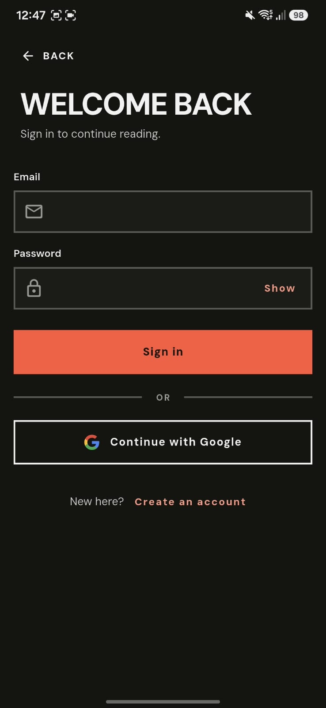 |  |
| Welcome | Sign in (email or Google) | Home: masthead, sections, Today's Brief, lead story |
|  |  | 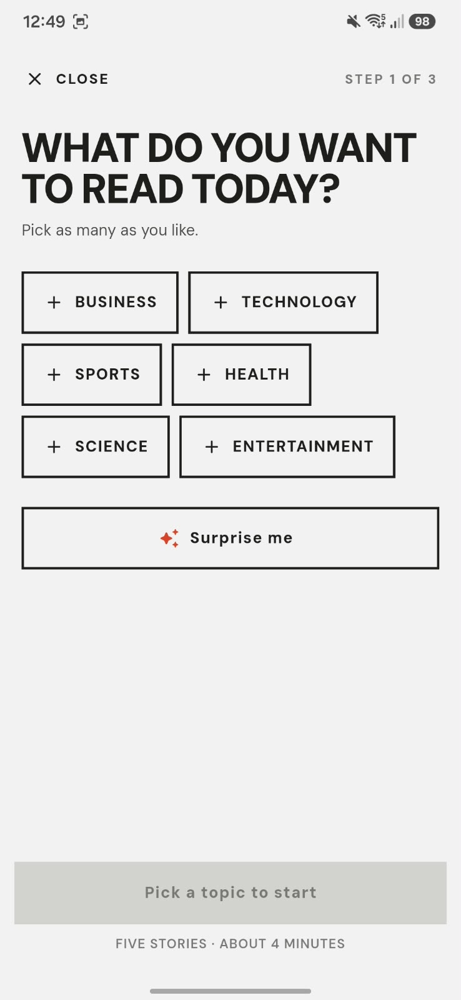 |
| Home: the numbered feed with a "YOU" badge on own articles | Reader: lenses, drop cap, Save · Listen · text size | Today's Brief: pick topics |
| 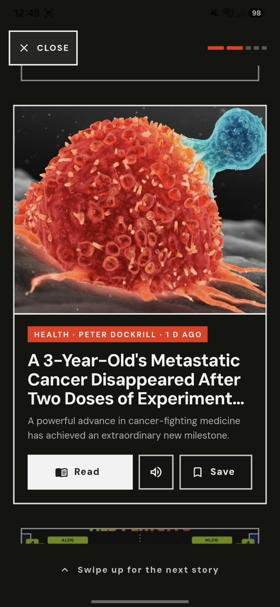 | 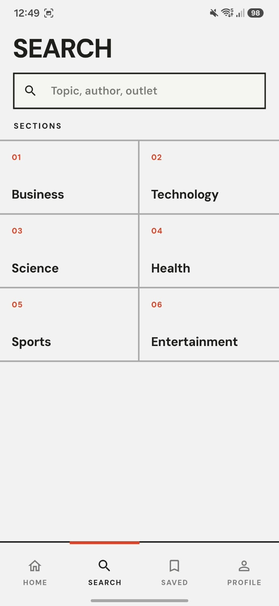 | 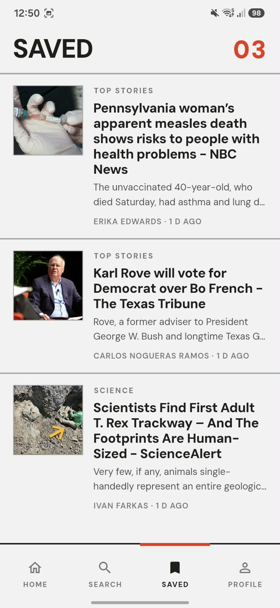 |
| Today's Brief: a story card with Read, Listen and Save | Search: sections grid | Saved articles |
| 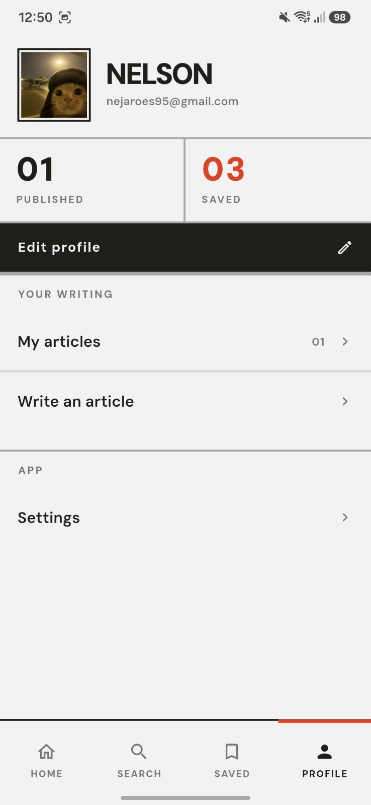 | 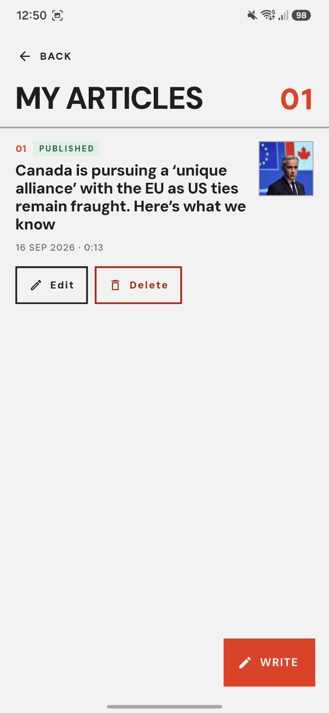 | 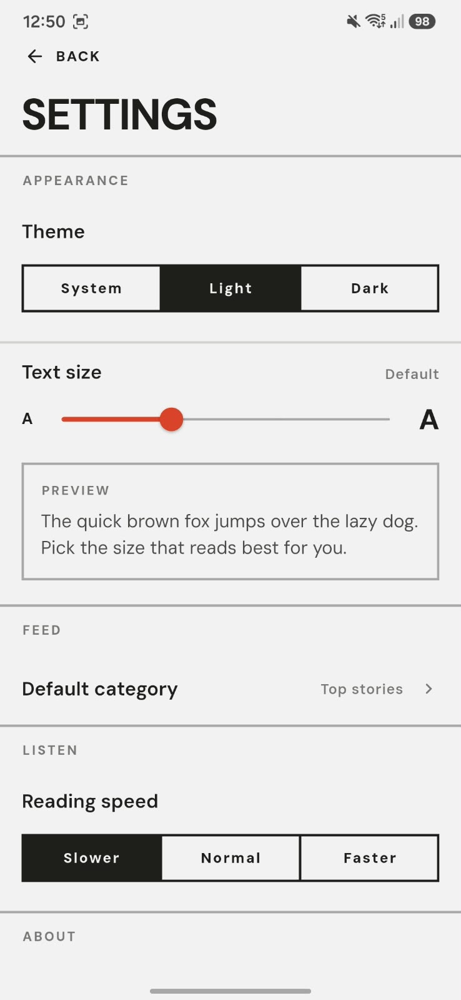 |
| Profile with counters | My articles: edit and delete | Settings |
| 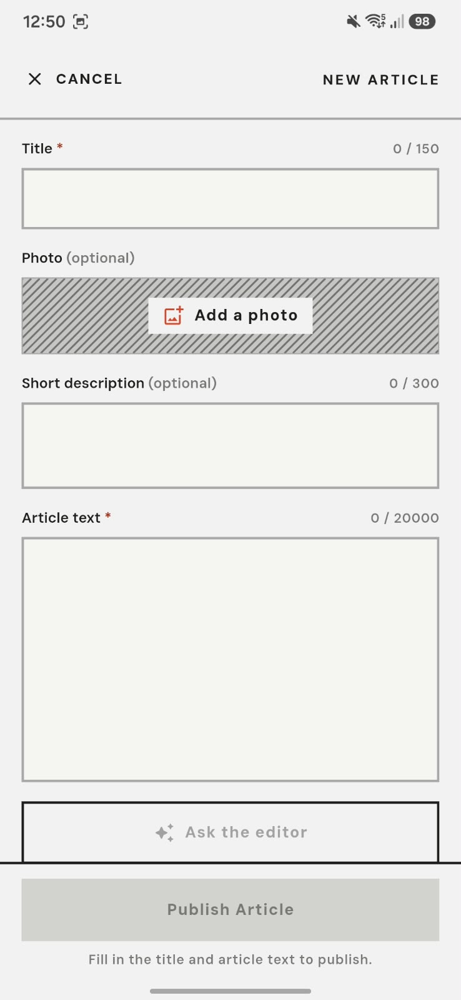 | 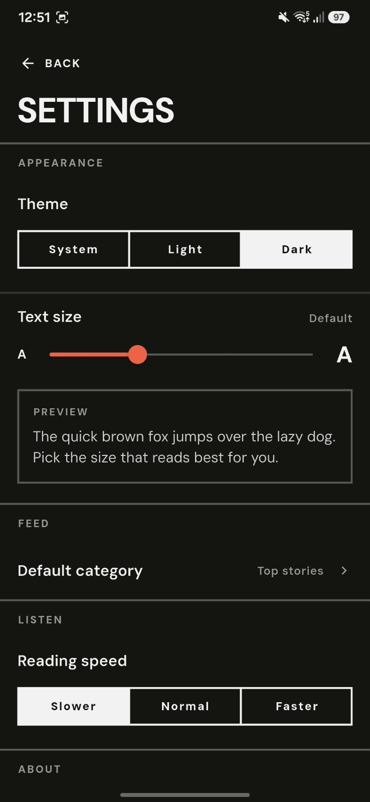 |  |
| Write: title, photo, description, text and Ask the editor | Settings, dark theme | Home, dark theme |
| 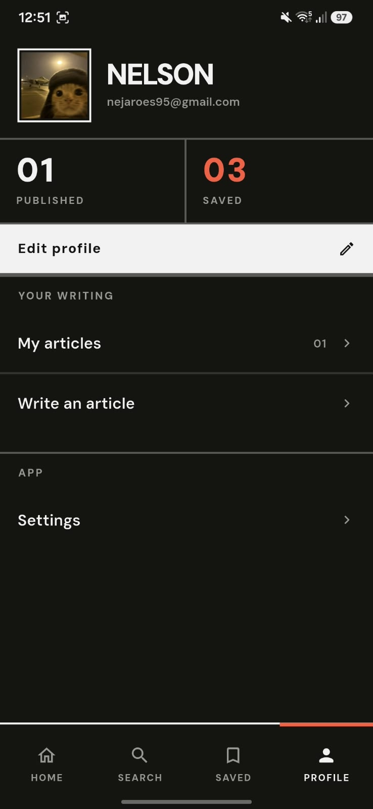 |
| Profile, dark theme |

## 6. Overdelivery

### 6.1 New features implemented

Everything below is in the app and in the video. Each entry says what it does and why it exists.

| Feature | What it does | Why |
|---|---|---|
| **Accounts** (email/password and Google) | Sign up, sign in, edit display name and photo. Articles carry the author's uid; rules enforce it. | Without accounts "my articles" is not a meaningful sentence, and ownership cannot be enforced in the rules. |
| **My articles** | List, edit and delete the articles you published; the feed refreshes after each change. | A journalist needs to see and correct their own work, not only publish it. |
| **Thumbnails and avatars in Cloud Storage** | Pick a photo, validate type and size before upload, upload under an owner-named path, replace or remove it on edit. | The assignment asks for `media/articles`; ownership and validation make it safe. |
| **Draft autosave** | The Write screen keeps the title, text, description, category and photo per account and restores them on the next visit; a Clear button wipes it. | Losing a half-written article is the worst thing a writing tool can do. |
| **Ask the editor** (AI) | From the body alone, proposes three headlines and a summary; each proposal has its own "Use this". Nothing is applied on the journalist's behalf. | Helps the writer without writing for them. Runs through a Cloud Function so the model key never reaches the app. |
| **Reader lenses** (AI) | *Brief it* turns the article into three bullets; *Plain words* rewrites it in short sentences for a reader who is ninety. The original is never changed. | The two audiences in the frontend guideline, served by the same article. |
| **Listen** | Reads the article, or the current lens, aloud with adjustable speed; also available on the brief cards. | Accessibility and hands-free reading. |
| **Today's Brief** | Pick topics, swipe through five stories, save or open them, finish with a summary of what you read. Once per day per account. | A ritual that gives the feed a beginning and an end. |
| **Search** | Full-text search on the provider with recent queries and section shortcuts, results in the feed row format. | Finding, not only browsing. |
| **Saved** | Bookmarks in SQLite, per account, with a "removed" notice that can be undone. | Reading later is the most requested feature of any news app. |
| **Settings** | Theme, text size (also from the reader), reading speed, default category (also from the section strip on Home), all per account. | Control without a settings maze. |
| **Modernist design system** | Paper and ink, one accent red, 2px rules instead of shadows, square blocks, DM Sans, a frosted-glass tab bar, hatched plates when a photo is missing, a brand block that reads on light and dark. | The Figma prototype was a starting point; the README allows and rewards improving it. The system is consistent across every screen and both themes. |
| **Security hardening** | Owner-named thumbnails, Firestore and Storage rules that agree, a daily allowance on the AI function, the news key supplied at build time. | The rules are the product's contract; the app is only one client of them. |
| **Continuous integration** | Analyzer, 451 Flutter tests with coverage, 15 function tests and 80 rules tests against the emulators on every pull request. | Quality that is verified, not claimed. |

### 6.2 Prototypes created

- **Database schema** (`backend/docs/DB_SCHEMA.md`): the Firestore and Storage layout, every field
  with its constraints, the upload flow, the access model, the Cloud Function contract and the
  extensions that were considered and left out. The rules and their tests were written from it.
- **UI system prototype**: before touching Flutter, the redesign was drafted as an HTML design
  canvas (light and dark variants, the tab bar, the feed, the reader and the brief cards) so the
  tokens, type scale and rules could be judged on a screen first. The Flutter theme in
  `frontend/lib/config/theme/` is a direct transcription of it.
- **Architecture of the shared modules**: `lib/shared/media/` and `lib/shared/firebase/` follow
  the `shared/{module}/{layer}` shape from `docs/APP_ARCHITECTURE.md`, so code two features need
  has a home that is not one of the features. Described in `frontend/README.md`.

### 6.3 How I would improve this

- Enforce App Check and add a budget alert (the two are cheap once the app is registered).
- Move the AI editor to streaming so long rewrites appear as they are generated.
- Add image compression on the device before upload; 5 MB is the ceiling, not the target.
- Localise the app; today it is English and US-only by decision (see 7.2), which keeps every
  string, the provider's country filter and the speech engine consistent, but the structure is
  ready for `intl`.
- Instrument the app (Crashlytics, a handful of analytics events) so decisions about the brief
  and the lenses can be made on usage instead of taste.

## 7. Extra sections

### 7.1 Metrics

| | |
|---|---|
| Pull requests merged in the fork | 33, one block each, reviewed through the CI |
| Flutter tests | 451 passing, `flutter analyze` clean |
| Line coverage | 98.3% of the lines inside the test boundary (SDK wrappers and the composition root are marked `coverage:ignore-file`, with the reason in each file) |
| Rules tests | 80 against the Firestore and Storage emulators |
| Cloud Function tests | 15 unit tests with a fake model client |
| Dart files in `lib/` | 220 |
| Test files | 117, mirroring `lib/` |

### 7.2 Decisions worth explaining

- **English and US-only.** The news provider needs a country for top headlines; the app pins it to
  `us` in the data source, the speech engine to `en-US`, and every string is English. A country
  picker and a Spanish lens were built and removed: half-localising an app is worse than not
  localising it.
- **No "delete account".** It was implemented and then removed from the UI: deleting an account
  must also delete its articles, thumbnails, avatar and bookmarks atomically, which belongs in a
  Cloud Function with a transaction, not in a client. Better absent than half-done.
- **Everything local is per account.** Bookmarks, settings, drafts and the brief are keyed by the
  account and cleared on sign-out. A shared phone must not leak one journalist's reading into
  another's.
- **Tests as a contract, not a number.** Standard `test/` layout mirroring `lib/`; plain unit tests
  for entities and use cases; repositories tested with their SDK mocked at the seam; cubits tested
  by driving them and asserting the states they emit, without a bloc-testing package (the frozen
  analyzer made the usual one unavailable, and the plain form reads just as well); screens tested
  by tapping through real flows. Files that only wrap an SDK are excluded from the coverage
  number, and the exclusion is written in each file.
- **Firebase configuration in the repository.** `google-services.json` and `firebase_options.dart`
  are committed, as Firebase's own guidance allows: they identify the project, they are not
  secrets, and the security rules and the function quota are what protect the data. The two real
  secrets, the model key and the news key, are outside the source (a Firebase secret and a
  build-time define).
- **Android only.** The starter ships an Android folder and nothing else; I kept that scope and
  documented in section 4 what adding iOS would take.

### 7.3 Repository map

```
backend/
  firestore.rules, storage.rules      schema enforcement
  tests/                              80 emulator tests
  functions/                          assistArticle (Claude) + usage quota, 15 tests
  docs/DB_SCHEMA.md                   the schema, the contract
frontend/
  lib/core/                           DataState, Failure, UseCase, runGuarded
  lib/config/                         theme (Modernist tokens), routes
  lib/features/{auth,daily_news,settings}/{domain,data,presentation}
  lib/shared/{media,firebase}/        code two features share, same layers
  lib/shared/presentation/            widgets, formatters, motion
  test/                               mirrors lib/
.github/workflows/ci.yml              analyzer, tests, rules, functions
docs/REPORT.md                        this document
```
